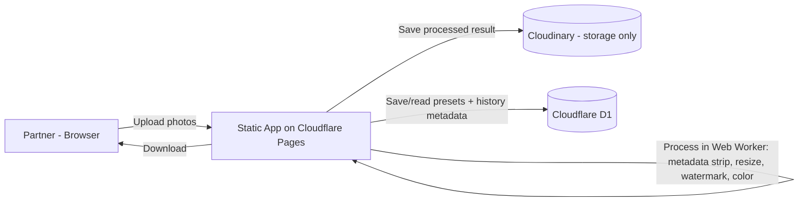
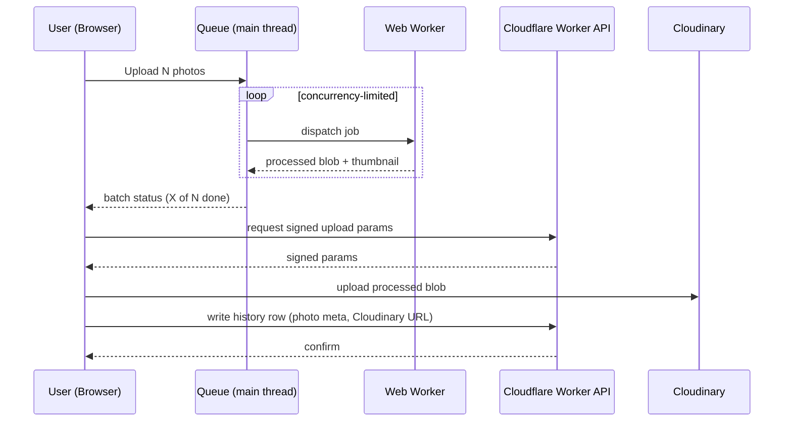

# System Architecture

## Document Status

- Status: Draft
- Owner: Hafizh
- Last verified: 2026-08-18
- Related ADRs: none yet

## System Context

- Clients and actors: single actor — partner (owner of [[mawmaw-interior]]), desktop-first browser, occasional phone upload
- Application or services: one static frontend app; no application server
- Primary database and storage: Cloudflare D1 (presets + history metadata) + Cloudinary (processed image files, storage-only)
- External systems: Cloudinary (upload/storage API)
- Trust boundaries: none beyond the browser — single user, no multi-tenant concerns, no public signup
- Regions or network boundaries: n/a — Cloudflare's global edge for static hosting, no region-pinning needed at this scale



## Architecture Style

- Selected style: client-heavy static app — all image processing runs in the browser (Canvas API + Web Workers), with a thin serverless layer only for metadata persistence and signed upload handoff.
- Why it fits the current scope: single user, zero-budget requirement, and no operation in the MVP feature set (metadata strip, resize/compress, watermark, non-destructive color preview) needs server-side compute. Doing it server-side would mean paying for or fighting free-tier CPU/bandwidth limits for no benefit.
- Explicitly rejected complexity: a Python/Pillow backend on a VPS (no VPS in scope), Cloudinary or ImageKit as the transform engine (their free tiers meter exactly the operation this app repeats most — see `docs/decisions.md`), Cloudflare Images (paid-only for this app's usage pattern), auth/multi-tenancy (single user).
- Expected scale and likely evolution trigger: a handful of photoshoots a month, tens of photos per batch. Revisit this style only if (a) AI enhance/upscale is added in v2 and needs GPU compute the browser can't do, or (b) a second user/role is ever introduced.

## Technology Stack

| Area | Choice and version | Purpose | Why selected | Source of truth |
|---|---|---|---|---|
| Runtime | Browser (evergreen Chrome/Safari/Edge) | All image processing | Zero server compute cost; Canvas/OffscreenCanvas cover every MVP operation | `package.json` |
| Language | TypeScript | App logic + processing pipeline | Type safety for the queue/worker message contracts | `package.json` |
| Web framework | Next.js (static export) | Frontend app | Matches the stack pattern used on other projects; static export deploys cleanly to Cloudflare Pages | `package.json` |
| UI framework | Tailwind CSS + shadcn/ui | Component styling | Consistency with [[my-port]] / [[lumina]] stack choices | `package.json` |
| Database | Cloudflare D1 (SQLite) | Presets + processing history metadata | Free tier (5GB, 5M reads/day) comfortably covers single-user volume | `docs/data-model.md` |
| ORM / query layer | Drizzle ORM | D1 access | Lightweight, typed, works well with D1's SQLite dialect | `package.json` |
| Object / file storage | Cloudinary (Free) | Stores processed photos for history/download-again | Already used for [[mawmaw-interior]]; storage-only usage keeps it well inside the 25-credit pool | `docs/decisions.md` |
| Image processing | Browser Canvas API / OffscreenCanvas, run inside Web Workers | Metadata strip, resize/compress, format convert, watermark composite, color adjustment preview | Free, no CPU-time ceiling like Workers has, keeps UI responsive via a queue | app code |
| Authentication | Cloudflare Access (Zero Trust) | Single-user edge identity protection with RS256 JWKS token validation on Worker | Zero public credentials embedded in client; blocks unauthenticated traffic at edge | `docs/security.md`, `workers/api/auth.ts` |
| Validation | Zod | Upload + preset form validation | Pairs naturally with TypeScript + Drizzle | `package.json` |
| Testing | Vitest | Unit tests for the processing pipeline logic | Fast, works well with Vite/Next tooling | `package.json` |
| Build / package manager | pnpm | — | Matches other projects | `package.json` |
| Hosting | Cloudflare Pages (frontend) + Cloudflare Workers (thin API for presets/history + signed Cloudinary uploads) | — | Confirmed choice, free tier | `wrangler.toml` |
| Observability | Cloudflare Pages/Workers built-in logs | Basic error visibility | Sufficient for single-user internal tool; no budget for a dedicated observability tool | — |

Dependency policy:

- Automatically allowed: small, well-maintained image/canvas helper libraries (e.g. a resizing helper) if they run client-side with no server component.
- Requires approval: anything that reintroduces server-side image processing, since that reopens the free-tier-limit problem this architecture exists to avoid.
- Banned or unsupported: any paid API called per-transformation (Cloudinary/ImageKit transform endpoints, Cloudflare Images), since usage would scale with her actual workflow and defeat the "free" requirement.
- Version and upgrade policy: pin major versions; upgrade opportunistically, no strict cadence needed for a single-user internal tool.

## Components and Boundaries

| Component | Responsibility | Owns data or contracts | May depend on | Must not depend on |
|---|---|---|---|---|
| Upload/Library UI | File intake, batch grid, status display | Client-side queue state | Processing Queue, Worker Pool API | D1/Cloudinary directly |
| Processing Queue | Concurrency-limited job scheduling (see `docs/decisions.md`) | Job state (queued/processing/done/error) | Worker Pool | UI internals |
| Worker Pool (Web Workers) | Actual pixel operations: metadata strip, resize, watermark, color | Nothing persisted | OffscreenCanvas, browser APIs | Network calls (kept pure/offline) |
| Preset Manager | CRUD for watermark/client presets | Preset entity | Cloudflare Workers API, D1 | — |
| Upload/History Service (Cloudflare Worker) | Issues signed Cloudinary upload params, writes history rows to D1, soft-deletes/restores batches & photos | History entity | Cloudinary API, D1 | Image processing logic (never touches pixels) |
| Purge Job (Cloudflare Cron Trigger) | Daily sweep: hard-deletes rows + Cloudinary assets past the 24h restore window | Nothing new (operates on existing entities) | Cloudinary API, D1 | UI-facing logic |
| Export | Packages processed results (single file or ZIP) for download | Nothing persisted | Worker Pool output | Server |

Cross-cutting rules:

- Domain and business rules live in: client-side app code (queue policy, default operation toggles).
- Database access occurs through: the Cloudflare Worker API only — the browser app never talks to D1 directly.
- External integrations are isolated behind: a single Cloudinary client module, so swapping storage providers later touches one file.
- Input validation occurs at: file-type/size check on upload (client), Zod schemas on the Worker API boundary.
- Authorization occurs at: n/a for v1 (no auth) — flagged in Open Architecture Decisions if this changes.
- Shared code may contain: pure processing functions, type definitions.
- Shared code must not contain: any Cloudinary secret/API key (Worker-only).

## Critical Runtime Flows

### Flow: Upload & Process (browser-side)

1. User selects/drops photos → files validated client-side (type, rough size sanity check).
2. Each file becomes a queue job (`queued`).
3. Queue dispatches jobs to a small Worker pool (concurrency ~2-3, tuned to `navigator.hardwareConcurrency`), respecting the order described in `docs/decisions.md`.
4. Worker performs the selected operations in sequence (metadata strip → watermark → resize/compress → color adjustment if opted-in) using OffscreenCanvas; returns a processed blob + thumbnail to the main thread.
5. Main thread updates job state to `done`, revokes intermediate object URLs, releases canvas memory.
6. On export, selected processed blobs are (a) offered as direct/ZIP download, and (b) uploaded to Cloudinary via a signed upload request obtained from the Worker API, with the resulting URL + metadata written to D1 as a history row.



## Repository Layout

```text
app/                 # Next.js routes (Library, Edit, Presets, Export)
lib/processing/       # Pure Canvas/OffscreenCanvas operations (metadata, resize, watermark, color)
lib/queue/             # Queue + worker-pool orchestration
workers/api/           # Cloudflare Worker: presets CRUD, signed upload, history writes
db/                     # Drizzle schema + migrations for D1
```

| Path | Owner/responsibility | Allowed dependencies | Generated or hand-written |
|---|---|---|---|
| `app/` | UI routes and components | `lib/*`, UI kit | Hand-written |
| `lib/processing/` | Image operation implementations | Browser APIs only | Hand-written |
| `lib/queue/` | Job scheduling | `lib/processing` | Hand-written |
| `workers/api/` | Preset/history/signed-upload endpoints | Drizzle, Cloudinary SDK | Hand-written |
| `db/` | Schema + migrations | Drizzle | Mixed (schema hand-written, migrations generated) |

## Runtime and Process Model

- Long-running processes: none — static frontend + on-demand Workers.
- Request-serving process: Cloudflare Workers (stateless, per-request).
- Background workers: browser Web Workers only (not server background jobs).
- Scheduled jobs: one Cloudflare Cron Trigger (free tier), running daily, that hard-deletes `Batch`/`HistoryItem` rows and their Cloudinary assets where `deleted_at` is more than 24 hours old — implements the restore-window described in `docs/data-model.md`.
- Queue or event consumers: client-side processing queue described above; no server-side queue needed at this scale.
- State held in memory: in-flight batch/job state lives in the browser tab only; refreshing mid-batch loses unsaved-but-unexported work (acceptable per the confirmed no-persistence-until-export answer).
- Horizontal scaling assumptions: none needed — single user, Cloudflare Workers scale automatically regardless.
- Graceful shutdown behavior: n/a (stateless Workers, ephemeral browser processing).

## External Integrations

| System | Purpose | Direction | Auth | Timeout | Retry | Failure/fallback | Sandbox available |
|---|---|---|---|---:|---|---|:---:|
| Cloudinary | Store processed photos for history | Outbound | Signed upload params (short-lived) issued by Worker | 30s | 1 retry on network failure | Show upload-failed badge on that photo, keep local download available regardless | Yes (free account itself) |

## Configuration and Environments

| Environment | Purpose | Data policy | External services | Deployment trigger | Access owner |
|---|---|---|---|---|---|
| Local | Development | Local D1 (wrangler dev), Cloudinary sandbox folder | Cloudinary (test folder) | Manual (`wrangler dev` / `next dev`) | Hafizh |
| Production | Live use by partner | Real D1, real Cloudinary account | Cloudinary (production) | Push to main → Cloudflare Pages auto-deploy | Hafizh |

- Environment variable source of truth: `.env` locally, Cloudflare Pages/Workers dashboard secrets in production.
- Secret manager: Cloudflare Workers secrets (`wrangler secret put`) for the Cloudinary API secret — never shipped to the client bundle.
- Feature flag approach: none needed at this scale; ship behind a branch instead.
- Local dependency approach: `wrangler dev` for D1 + Worker emulation.

## Data, Cache, Files, and Search

- Primary persistence: Cloudflare D1 (presets, history metadata).
- Cache: none needed — traffic volume doesn't warrant it.
- Queue: client-side only, in-memory (see above); no server queue product needed.
- File upload and storage path: browser → processed in-memory → (optional) uploaded to Cloudinary on export/save.
- Search: not needed for v1 (history list is small enough to browse/filter client-side).

Detailed relational design belongs in `docs/data-model.md`.

## Performance and Capacity

| Operation | Expected load | Target | Measurement method |
|---|---:|---:|---|
| Batch size | Up to ~50 photos/session | Queue stays responsive, no tab freeze | Manual test with a real photoshoot batch |
| Single photo processing | Camera JPEGs up to ~40MB | Under a few seconds per photo per operation | Manual timing during dev |

- Maximum payload/upload size: soft warning above ~40MB per photo (phone/camera originals); hard block only if the browser genuinely can't handle it in testing.
- Known hot paths: the Worker pool during large-batch processing — this is the one place to profile if she reports lag.
- Capacity trigger that requires redesign: if photo volume or resolution grows enough that in-browser processing becomes impractically slow — that's the point to revisit server-side processing (and re-open the cost question).

## Reliability Principles

- Timeout policy: Cloudinary upload requests time out at 30s (see External Integrations).
- Retry policy: one automatic retry on upload failure; processing failures (corrupt file) are not retried automatically, surfaced as a per-photo error instead.
- Partial failure behavior: one failed photo in a batch never blocks the rest (per `DESIGN.md` Required States).
- Health/readiness behavior: n/a — static app, no health check needed.

## Known Trade-offs and Technical Debt

| Trade-off | Reason accepted | Impact | Owner | Revisit trigger |
|---|---|---|---|---|
| No server-side processing | Zero-cost requirement, no VPS/GPU available | Processing speed depends on her device; large batches take longer than a server-side pipeline would | Hafizh | If she reports the browser struggling, or v2 AI-enhance needs a server anyway |
| No auth | Single user, internal tool | If the app URL leaks, anyone with the link could use it (no sensitive data exposed, but still worth noting) | Hafizh | If this ever becomes multi-user or client-facing |
| No persistence until export | Simpler state model, matches her confirmed workflow | Refreshing mid-batch loses in-progress (not-yet-exported) work | Hafizh | If she reports losing work regularly |

## Open Architecture Decisions

| Question | Options considered | Blocking | Owner | Needed by |
|---|---|:---:|---|---|
| Exact Worker-pool concurrency default | Fixed (e.g. 2), or `navigator.hardwareConcurrency`-based | No (safe default exists) | Hafizh | Before implementation |
| Whether the Cloudflare Worker API needs any access control (e.g. a shared secret) even without full auth, since it's a public URL | Open URL with no gate / simple shared-secret header | No, but worth a decision before going live | Hafizh | Before deployment.md |
