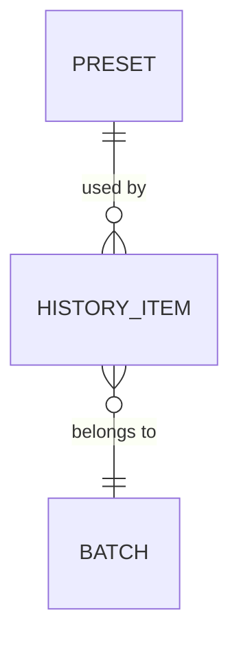

# Database and Data Model

## Document Status

- Status: Draft
- Owner: Hafizh
- Last verified: 2026-08-18
- Executable schema path: `db/schema.ts` (Drizzle)
- Migration path: `db/migrations/`

## Storage Overview

| Storage | Product/version | Purpose | Source of truth | Backup required |
|---|---|---|---|:---:|
| Primary database | Cloudflare D1 (SQLite) | Presets + processing history metadata | `db/schema.ts` | No (low-value, easily recreated data; presets can be re-entered if ever lost) |
| Object storage | Cloudinary (Free) | Processed photo files | Cloudinary | No (single-user internal tool; loss means re-processing from local originals if she kept them) |

Conventions:

- Primary-key strategy: text UUID (`crypto.randomUUID()`), generated client- or Worker-side.
- Time storage and precision: ISO 8601 text (SQLite has no native datetime type); stored in UTC.
- Time-zone policy: stored UTC, displayed in her local time in the UI.
- Enum representation: text columns with a small fixed set of allowed values, validated by Zod at the Worker boundary (D1/SQLite has no native enum type).
- JSON usage policy: allowed for the watermark preset's positioning config (position/opacity/scale/rotation) — a small, non-queried settings blob doesn't need separate columns.
- Soft-delete policy: used for `Batch` and `HistoryItem` only — a 24-hour recoverable "trash" window so an accidental delete can be undone from the UI, then a scheduled job hard-deletes both the row and the Cloudinary asset after 24 hours. `Preset` stays hard-delete (low accidental-delete risk, edited far less often).
- Tenant/workspace isolation: not applicable — single user, no tenancy model in v1.
- Audit-column policy: `created_at` on every table; `updated_at` on `preset` only (history rows are immutable once written).

## Entity Relationship Diagram

## Entity Catalog

| Entity | Purpose | Created by | Lifecycle summary | Retention |
|---|---|---|---|---|
| `Preset` | Saved watermark/brand settings, reusable per client | Owner, in Preset Manager | Created → edited any time → deleted when no longer needed | Kept indefinitely; hard-deleted on request |
| `Batch` | One upload session, groups photos processed together | Owner, on upload | Created on upload → closed once exported | Kept indefinitely as history; hard-deleted on request |
| `HistoryItem` | One processed photo's record (points at the Cloudinary file) | Owner, on export/save | Created once, immutable | Kept indefinitely; hard-deleted on request (does not delete the Cloudinary asset automatically — see Open Data Decisions) |

## Entity Definitions

### Entity: `Preset`

- Purpose: reusable watermark/brand configuration so she doesn't re-set logo position per job.
- Expected row count at launch: a handful (one per client/brand).
- Expected growth: slow — new row only when she onboards a new client.

| Column | Type | Null | Default | Key | Meaning |
|---|---|:---:|---|---|---|
| `id` | text (UUID) | No | — | PK | — |
| `name` | text | No | — | UNIQUE | Client/brand label shown in the dropdown |
| `logo_url` | text | No | — | | Cloudinary URL of the uploaded logo asset |
| `settings` | text (JSON) | No | — | | `{ position, opacityPct, scalePct, rotationDeg }` |
| `created_at` | text (ISO 8601) | No | now | | — |
| `updated_at` | text (ISO 8601) | No | now | | — |

Invariants:

- `name` must be unique (used as the human-facing selector; two presets with the same name would confuse the dropdown).
- `settings.opacityPct` and `scalePct` must be within 0–100.

### Entity: `Batch`

- Purpose: groups the photos from one upload session, so the Library/history view can show "Client X — 12 photos — Aug 18" rather than a flat photo list.
- Expected row count at launch: one per shoot/session, low volume.

| Column | Type | Null | Default | Key | Meaning |
|---|---|:---:|---|---|---|
| `id` | text (UUID) | No | — | PK | — |
| `label` | text | Yes | null | | Optional name she gives the batch (defaults to date if left blank) |
| `preset_id` | text (UUID) | Yes | null | FK → `Preset.id` | Preset applied to this batch, if any (kept even if the preset is later edited, for history accuracy — see Derived fields) |
| `created_at` | text (ISO 8601) | No | now | | — |
| `deleted_at` | text (ISO 8601) | Yes | null | | Set when the owner deletes the batch from the UI; row + its Cloudinary assets are purged 24h after this timestamp |

Relationships:

| Local column | Target | Cardinality | On delete |
|---|---|---|---|
| `preset_id` | `Preset.id` | many-to-one | `SET NULL` — deleting a preset must not delete past batch history |

### Entity: `HistoryItem`

- Purpose: one processed photo, pointing at where the final file lives in Cloudinary.
- Expected row count at launch: tens per batch, growing steadily but slowly (single-user volume).

| Column | Type | Null | Default | Key | Meaning |
|---|---|:---:|---|---|---|
| `id` | text (UUID) | No | — | PK | — |
| `batch_id` | text (UUID) | No | — | FK → `Batch.id` | — |
| `original_filename` | text | No | — | | For her own reference, not a system identifier |
| `cloudinary_url` | text | No | — | | Where the processed file lives |
| `operations_applied` | text (JSON) | No | — | | `{ metadataStripped, watermarked, resized, colorAdjusted }` — a simple record of what ran, for her own transparency, not for re-processing logic |
| `created_at` | text (ISO 8601) | No | now | | — |
| `deleted_at` | text (ISO 8601) | Yes | null | | Set when the owner deletes the photo (directly, or via its batch being deleted); purged 24h after this timestamp |

Relationships:

| Local column | Target | Cardinality | On delete |
|---|---|---|---|
| `batch_id` | `Batch.id` | many-to-one | `CASCADE` — deleting a batch deletes its photo records (the Cloudinary files themselves are a separate, deliberate action — see Open Data Decisions) |

Invariants:

- A `HistoryItem` is immutable once created — reprocessing a photo creates a new row rather than editing the existing one, so history stays an honest record.

## Relationship Matrix

| Parent | Child | Cardinality | On delete | Orphan allowed | Reason |
|---|---|---|---|:---:|---|
| `Preset` | `Batch` | one-to-many | `SET NULL` | Yes | A batch's history should survive even if the preset used is later removed |
| `Batch` | `HistoryItem` | one-to-many | `CASCADE` | No | A history item without a batch has no meaningful grouping in the UI |

## Access and Row-Level Data Rules

Not applicable in v1 — no auth, single actor, every row is readable/writable by the one user. Revisit this section if the "no auth" decision in `ARCHITECTURE.md` ever changes.

## Query Patterns and Indexes

| ID | Query | Filters | Sort | Index |
|---|---|---|---|---|
| Q-001 | List presets for the watermark dropdown | none | `name` asc | none needed at this row count |
| Q-002 | List batches for the history view | none | `created_at` desc | index on `Batch.created_at` |
| Q-003 | List photos within a batch | `batch_id` | `created_at` asc | index on `HistoryItem.batch_id` (also needed for the FK) |

At this data volume (dozens to low hundreds of rows per table), these are precautionary rather than load-driven — SQLite handles this comfortably either way.

## Migration and Backfill Strategy

- Migration tool: Drizzle Kit (`drizzle-kit generate` + `wrangler d1 migrations apply`).
- Naming convention: Drizzle's default timestamped migration files.
- Backfill needs: none at launch — this is a greenfield schema.
- Production migration owner: Hafizh (manual apply, low-stakes single-user data).

## Data Classification, Retention, and Deletion

| Data group | Classification | Retention | Deletion trigger |
|---|---|---|---|
| Preset logos, watermark settings | Internal | Indefinite | Manual delete by owner |
| Batch/HistoryItem metadata | Internal | Indefinite | Manual delete by owner |

No personal data about third parties (clients) beyond a name label is stored — no compliance/export workflow needed at this scale.

## Open Data Decisions

| Question | Affected entities | Blocking | Owner | Needed by |
|---|---|:---:|---|---|
| Should `Batch.label` auto-suggest the client name from the most recently used preset, to save her typing? | `Batch` | No | Hafizh | Nice-to-have, not blocking |

Resolved: deleting a `HistoryItem`/`Batch` sets `deleted_at` (soft delete, restorable from the UI for 24 hours); a scheduled Worker cron job hard-deletes the row and its Cloudinary asset once `deleted_at` is more than 24 hours old. See `docs/deployment.md` for the cron schedule.
