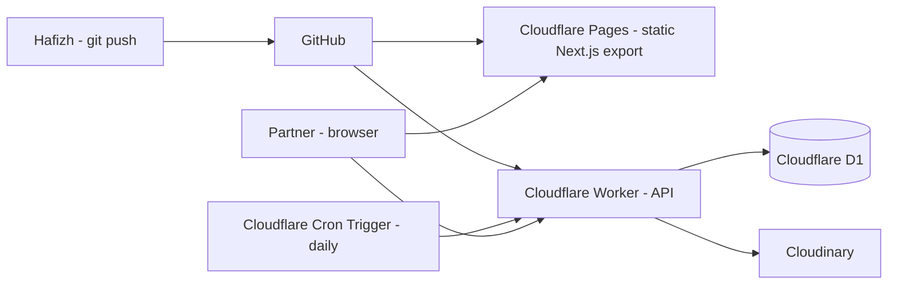

# Deployment, Release, and Operations

## Document Status

- Status: Draft
- Service owner: Hafizh
- Last verified: 2026-08-18
- Infrastructure source path: `wrangler.toml`
- Pipeline source path: `.github/workflows/deploy.yml`

## Deployment Topology

| Component | Hosting | Scaling | Publicly reachable | Stateful |
|---|---|---|:---:|:---:|
| Frontend (static export) | Cloudflare Pages | Automatic (CDN) | Yes (gated by shared-secret header on API calls, not by a login wall) | No |
| API | Cloudflare Workers | Automatic | Yes, same gating | No |
| Database | Cloudflare D1 | Cloudflare-managed | No (Worker-only access) | Yes |
| Purge job | Cloudflare Cron Trigger | n/a | No | No |

## Environment Matrix

Two environments only — a Staging tier isn't worth the overhead for a single-user internal tool; Cloudflare Pages' automatic Preview deployments on each PR/branch push cover the "try it before it's real" need instead.

| Environment | Purpose | Access | Data policy | Deployment trigger |
|---|---|---|---|---|
| Local | Development | `wrangler dev` + `next dev` | Local D1, Cloudinary sandbox folder | Manual |
| Preview | Sanity-check a change before it's live | Cloudflare Pages preview URL (auto-generated per branch) | Same D1/Cloudinary as production (small scale, low risk) — or a sandbox folder if a change touches delete logic | Push to a non-main branch |
| Production | Real use by partner | Production URL | Real D1, real Cloudinary | Push/merge to `main` |

## Infrastructure and Provisioning

- Infrastructure-as-code: `wrangler.toml` (Workers, D1 binding, Cron Trigger schedule, Pages config) — Cloudflare's own config format, no separate Terraform needed at this scale.
- DNS/TLS: Cloudflare-managed automatically for the Pages/Workers subdomain (or her own domain later if she wants one — not required for v1).
- Database provisioning: `wrangler d1 create`, migrations via Drizzle Kit as described in `docs/data-model.md`.
- Manual changes allowed: yes, for a project this size — a full change-management process would be disproportionate. `wrangler.toml` stays the source of truth so manual dashboard tweaks don't silently drift.

## Configuration and Secrets

| Secret | Required in | Purpose | Source |
|---|---|---|---|
| `CLOUDINARY_API_SECRET` | Worker only | Signed uploads/deletes | `wrangler secret put` |
| `CLOUDINARY_API_KEY` | Worker only | Cloudinary auth | `wrangler secret put` |
| `APP_SHARED_SECRET` | Worker (validates) + Pages build (injects into client fetch calls) | Low-effort access gate described in `docs/security.md` | `wrangler secret put` (Worker) + Cloudflare Pages environment variable (build-time, not committed) |
| `CLOUDINARY_CLOUD_NAME` | Client (safe to expose) | Building asset URLs | Cloudflare Pages environment variable |

- Example environment file: `.env.example` with placeholder values only.
- Startup behavior for missing config: Worker fails fast with a clear error on missing secrets rather than silently misbehaving.

## CI/CD Pipeline

| Stage | Trigger | Action | Failure behavior |
|---|---|---|---|
| Validate | Every push | Lint + typecheck | Block merge |
| Test | Every push | `pnpm test` (unit + integration) | Block merge |
| Build | Every push | `pnpm build` (Next.js static export) | Block merge |
| Deploy preview | Push to non-main branch | Cloudflare Pages auto-deploys a preview URL | N/A (informational) |
| Deploy production | Merge to `main` | Cloudflare Pages + `wrangler deploy` for the Worker | Manual rollback (see below) if something's broken |

GitHub Actions free tier (2,000 minutes/month for private repos) comfortably covers this — a project this size won't come close to the limit.

## Release and Migration Sequence

| Order | Action | Verification |
|---:|---|---|
| 1 | Apply any new D1 migration (`wrangler d1 migrations apply`) | Migration runs clean against production D1 |
| 2 | Deploy Worker (API + Cron Trigger config) | Worker responds to a manual smoke request |
| 3 | Deploy Pages (frontend) | Preview URL sanity-checked, then promoted |

Given the low stakes and single-user scope, migrations are applied directly rather than through a formal expand-and-contract window — acceptable here because a brief mismatch window affects only Hafizh's own testing, not real client work in progress.

## Deployment Strategy

- Strategy: recreate (Cloudflare Pages/Workers deploys are effectively instant cutover — no rolling/canary infrastructure needed at this scale).
- Manual approval point: Hafizh reviews the Preview URL before merging to `main`.
- Automatic rollback: none configured — see Rollback below for the manual procedure.

## Rollback and Forward Fix

| Failure | Immediate containment | Rollback | Owner |
|---|---|---|---|
| Bad frontend deploy | Cloudflare Pages keeps prior deployments — instantly re-promote the last-known-good deployment from the Pages dashboard | Same | Hafizh |
| Bad Worker deploy | `wrangler rollback` to the previous Worker version | Same | Hafizh |
| Bad D1 migration | Depends on the migration — irreversible schema changes require a forward-fix migration rather than a true rollback (SQLite/D1 has no automatic down-migration safety net) | Forward-fix | Hafizh |

## Observability

- Logging: Cloudflare Workers' built-in real-time logs (`wrangler tail`) and the dashboard's request log — sufficient for a single-user tool with low request volume; no dedicated logging service needed.
- Metrics: Cloudflare's built-in Pages/Workers analytics (requests, errors, CPU time) — free, no custom dashboard needed.
- Alerts: none configured — at this scale, "she tells Hafizh something's broken" is the realistic incident channel, not automated paging.

## Backups and Disaster Recovery

| Resource | Backup method | Restore path |
|---|---|---|
| D1 (presets/history metadata) | `wrangler d1 export` run manually before any risky schema change; otherwise unbacked (low-value, recreatable data) | Re-import the export, or re-enter presets manually if lost |
| Cloudinary (actual photo files) | Cloudinary's own platform durability; no separate backup | Cloudinary support / account recovery if ever needed |

- Recovery point/time objective: informal — acceptable data-loss window is "since the last manual export," appropriate given this is not business-critical infrastructure.

## Scheduled Operations and Maintenance

- Purge job: Cloudflare Cron Trigger, runs daily, hard-deletes `Batch`/`HistoryItem` rows and their Cloudinary assets where `deleted_at` is more than 24 hours old (see `docs/data-model.md`).
- Dependency updates: opportunistic, no fixed cadence.
- Secret rotation: only if a leak is suspected (see `docs/security.md`).

## Production Readiness Checklist

### Product and Contracts
- [ ] MVP scope from `PROJECT.md` matches what's actually built.
- [ ] Feature specs have acceptance criteria with evidence in `docs/testing.md`.

### Data and Security
- [ ] D1 migrations reviewed.
- [ ] Shared-secret gate is live on every Worker endpoint.
- [ ] No secrets committed to the repo (GitHub secret scanning clean).
- [ ] 24h soft-delete/restore verified end-to-end at least once manually.

### Application Quality
- [ ] Lint, typecheck, unit tests, and production build pass.
- [ ] Loading/empty/error/success states verified per `DESIGN.md`.
- [ ] Manual keyboard/contrast pass done.

### Operations
- [ ] Cron Trigger for the purge job is deployed and confirmed running (check the dashboard after the first scheduled run).
- [ ] Rollback procedure (Pages re-promote, `wrangler rollback`) tested at least once, not just documented.

## Release Record

To be filled in at first actual production deploy — version/commit, date, migrations applied, smoke-test evidence, known issues.
