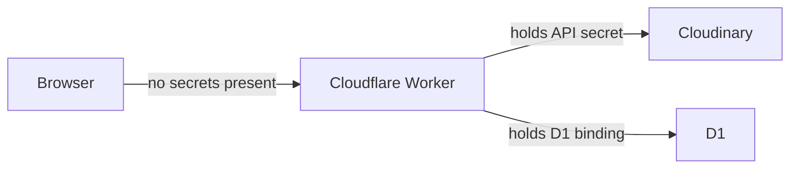

# Security and Privacy

## Document Status

- Status: Draft
- Security owner: Hafizh
- Last reviewed: 2026-08-18
- Required compliance baseline: none formal — this is an internal single-user tool, not a product handling third-party user data at scale

## Assets and Trust Boundaries

| Asset | Value/impact if lost | Who may access it | Where processed | Classification |
|---|---|---|---|---|
| Client photos (in-flight) | Low — recoverable from her local originals; not personally sensitive beyond being unpublished work | Owner only, in her browser | Browser memory only, never leaves the device until she chooses to export | Internal |
| Processed photos (Cloudinary) | Low-moderate — could reveal unreleased client work if the URL leaked | Owner (via app); anyone with a direct Cloudinary URL | Cloudinary | Internal |
| Watermark logos | Low | Owner | Cloudinary + D1 reference | Internal |
| Cloudinary API secret | High — leak lets anyone read/write/delete her Cloudinary account | Cloudflare Worker only | Cloudflare Worker secret store | Confidential |

The one real trust boundary worth naming: the browser bundle must never contain the Cloudinary API secret — all signed-upload logic happens in the Worker.

## Threat Model

| Threat | Entry point | Impact | Likelihood | Prevent | Detect | Respond |
|---|---|---|---|---|---|---|
| Worker API URL discovered/scraped, used by someone else | Public Worker endpoint (no auth) | Low-impact spam data / unwanted D1 rows or Cloudinary uploads on her account | Low (obscure URL, no marketing/links to it) | Shared-secret header required on all Worker endpoints (see Authentication) | Unexpected spike in D1 rows or Cloudinary usage | Rotate the shared secret, tighten Cloudflare firewall rule to known IP if it recurs |
| Malicious/oversized file uploaded (e.g. disguised non-image file) | Photo upload | Browser tab crash/hang at worst; no server-side execution risk since processing is client-side Canvas, not a file-execution path | Low | MIME-type + magic-byte check before processing, size ceiling (~40MB) | Processing error surfaced per-file | Reject file, show per-photo error, batch continues |
| Cloudinary secret leaked via source control or logs | Repo, CI logs | High — full Cloudinary account access | Low if handled correctly | Never commit secrets; `.env` gitignored; Worker secret via `wrangler secret put` only | Secret-scanning on the repo (see Dependencies and Supply Chain) | Rotate the Cloudinary API key immediately, audit account activity |
| Someone else's device left logged into the app (no auth = no session to leave logged into, but the URL itself is unrestricted) | Shared/public device | Low — internal, non-financial data | Low | Shared-secret gate reduces casual discovery | — | Rotate the secret |

Not applicable at this scale, explicitly excluded: cross-tenant access, account takeover, CSRF/session attacks (no sessions), SSRF, DDoS beyond Cloudflare's default protection.

## Authentication

- Identity provider: none — single user, no login flow.
- Access control substitute: every Worker API endpoint requires a static shared-secret header (`X-App-Secret`), checked server-side before any D1/Cloudinary operation. This is not real authentication — it's a low-effort gate against casual/accidental discovery of the URL, appropriate to the actual risk level (no sensitive data, no financial exposure).
- Session or token storage: n/a.
- Service account authentication: the Worker authenticates to Cloudinary using an API key/secret pair stored as a Cloudflare Worker secret, never exposed to the browser.

## Authorization

Not applicable — single principal, every resource is hers. No role matrix needed. Revisit this whole section if the tool ever becomes multi-user.

## Input, Output, and File Safety

| Boundary | Input source | Validation | Size/rate limit |
|---|---|---|---|
| Photo upload | Browser file picker/drag-drop | MIME type allowlist (JPEG/PNG/WebP) + magic-byte sniff, not just file extension | Soft warning ~40MB/file, no hard batch limit at this scale |
| Preset form (name, logo) | Preset Manager UI | Zod schema on the Worker boundary — required fields, opacity/scale ranges | Logo upload same image-safety checks as photos |
| Worker API requests | Browser fetch calls | Zod-validated request bodies; shared-secret header required | Relies on Cloudflare's default abuse protection at this traffic volume — no custom rate limiter needed |

- Filename and path handling: uploaded filenames are stored as display metadata only (`original_filename` in `HistoryItem`), never used to construct a filesystem path — Cloudinary handles storage addressing internally.
- Malware scanning: not implemented — accepted risk given the file-safety checks above and that files are processed client-side (Canvas), not executed.
- Archive/decompression: not applicable — no archive upload support in v1.

## Browser and Client Security

- Cookie attributes: none used (no auth session).
- CSRF protection: not applicable in the traditional sense (no cookie-based session to forge), but the shared-secret header on Worker calls incidentally prevents naive cross-origin abuse too.
- CORS policy: Worker API restricts allowed origins to the deployed Pages domain (and `localhost` in dev) — not left open (`*`).
- Content Security Policy: default-src self, restricting script/style origins to the app's own domain plus Cloudinary's asset domain.
- Client-visible environment variables: only the Cloudinary cloud name (public, safe to expose) and the app's own API base URL — never the API secret.

## Secrets and Key Management

| Secret | Used by | Storage | Rotation |
|---|---|---|---|
| Cloudinary API secret | Worker (signed upload, delete) | Cloudflare Worker secret (`wrangler secret put`) | Manual, rotate if ever suspected leaked |
| Worker shared-secret header value | Worker (request gate) | Cloudflare Worker secret + stored client-side in a build-time env var (not committed) | Manual rotation if the URL is ever shared beyond intended use |

- No real secrets in source, examples, or fixtures — `.env.example` ships with placeholder values only.
- Production secret injection: via Cloudflare dashboard / `wrangler secret put`, never via committed files.

## Data Protection and Privacy

- Data classifications: see `docs/data-model.md`.
- Encryption in transit: HTTPS everywhere by default (Cloudflare Pages/Workers, Cloudinary).
- Encryption at rest: handled by Cloudinary and Cloudflare D1's own platform guarantees — no additional field-level encryption needed for this data sensitivity level.
- User deletion and retention: covered by the 24-hour soft-delete/restore window in `docs/data-model.md`.
- Third-party processors: Cloudinary (image storage), Cloudflare (hosting/compute/database). No other processor in the loop.

## Rate Limits and Abuse Controls

Not a priority at this traffic volume (single user, low request rate) — Cloudflare's platform-level protections are sufficient. Revisit only if the shared-secret header is ever compromised and abuse is observed.

## Dependencies and Supply Chain

- Lockfile policy: commit `pnpm-lock.yaml`, no floating versions in production.
- Secret scanning: enable GitHub secret scanning on the repo (free for public and private repos on GitHub).
- Update ownership: Hafizh, opportunistic — no formal cadence needed for a single-user internal tool.

## Security Verification

- Static analysis / secret scan: GitHub's built-in secret scanning (free).
- Manual review: Hafizh reviews before each deploy given the small surface area — no dedicated pen test budget or need at this scale.

## Accepted Risks and Open Questions

| Risk | Impact | Current control | Accepted by | Review trigger |
|---|---|---|---|---|
| No real authentication, only a shared-secret header | Low — no sensitive/financial data, single user | Shared-secret header + obscure URL | Hafizh | If the tool becomes multi-user or client-facing |
| No malware/content scanning on uploads | Low — client-side Canvas processing, no server execution of uploaded files | MIME/magic-byte check only | Hafizh | If the tool ever accepts uploads from anyone other than the owner |
